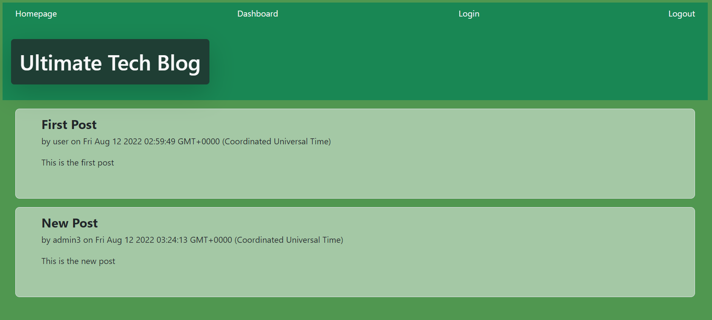

# Ultimate Tech Blog 4.2.0

## Description
This application is a blog about technology and allows the users to create posts and see all users posts, it allows you to create a new profile and manage your posts individually.
The app was made using nodejs, the MVC model with sequalize, mysql2 and express, it uses password encryption and .env files to protect the user's info, and the frontend uses handlebars. Finally the app is deployed using heroku and jawsdb as database manager. 

## Table of Contents (Optional)

- [Usage](#usage)
- [Licence](#licence)

## Usage
You can create a new user or log in if you have one already, then you can make post or see everybody ones, at the end, the app lets you log out.
[Deployed App](https://calm-sands-66373.herokuapp.com/)

## Licence
The Unlicense

## Questions
[Github Profile](https://github.com/braulioloaizac)

Email : bloaizac@uqvirtual.edu.co

